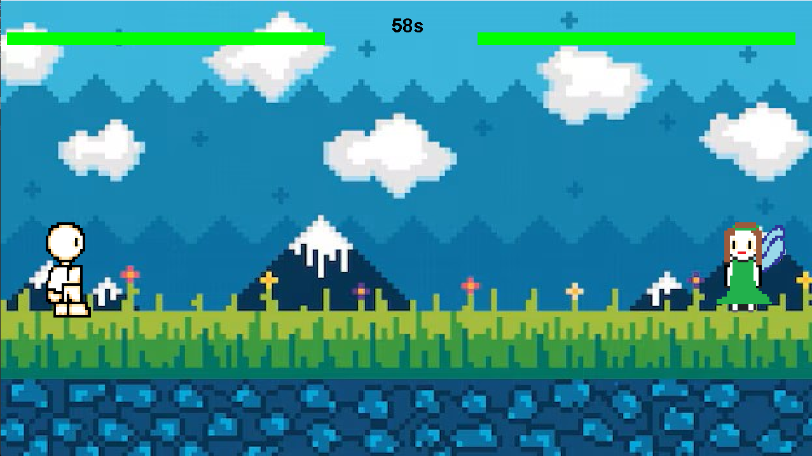

# Magic Duel Quest

Magic Duel Quest es un juego en el que se pueden elegir entre dos personajes con diferentes caracteristicas y un diverso número de mapas para pelear.
Cada juego constará de 3 rondas y gana el que gane más rondas.

## Modo de descargar Magic Duel Quest
Si no funciona el .jar en primera instancia podria deberse a que no se tiene un reproductor de java adecuado aquí dejo posibles soluciones.

- Descargarme Java para desktop en el siguiente enlace 
```
https://www.java.com/es/
```

- Descargarme el JarFix en el siguiente enlace:
```
https://johann.loefflmann.net/en/software/jarfix/index.html
```

- Descargarme un JDK adecuado ya que no tenia uno adecuado a mi sistema en el siguiente enlace:
```
https://www.oracle.com/java/technologies/downloads/#jdk23-windows
```
## Descarga del juego
1. Pinchar el .jar y deberia funcionar.
2. Ir a plataforma preferenciarmente Eclipse que es la usada y empezar a ejecutar desde main.
3. Desde una terminal viaja mediante comandos cd a tu carpeta de descarga del .jar y ejecuta la siguiente orden:
```
java -jar MagicDuelQuest.jar
```
## Mecánica del juego:


## Pantallas del juego
Enter para pasar a la siguiente pantalla

<p align="center">
  
</p>

Pinchar 2 veces una por cada jugador para elegir personaje
<p align="center">
  
</p>


Pinchar en el mapa deseado


Pantalla de partida con contador de 60 segundos, gana el que mate al contrario.



Pantalla de anuncio del Ganador 


## Diagrama UML
Diagrama UML del programa principal


Diagrama UML de Partida.


